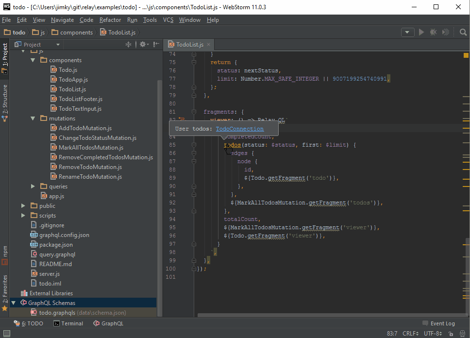

# JS GraphQL IntelliJ Plugin

__Note:__ V2.0 is in active development. See the [v2 branch](https://github.com/jimkyndemeyer/js-graphql-intellij-plugin/tree/v2) and [#164]( https://github.com/jimkyndemeyer/js-graphql-intellij-plugin/issues/164)

GraphQL language support including Relay.QL tagged templates in JavaScript and TypeScript.

It provides the following features in IntelliJ IDEA, WebStorm, RubyMine, PhpStorm, and PyCharm:

- Schema-aware completion, error highlighting, and documentation
- Syntax highlighting, code-formatting, folding, commenter, and brace-matching
- 'Find Usages' and 'Go to Declaration' for schema types and fields
- Schema viewer and 'Go to Implementation' for schema interfaces
- 'Structure view' to navigate GraphQL and GraphQL Schema files
- Configurable GraphQL schema retrieval and reloading based on a local file or a url using 'then-request'
- Execute queries with variables against configurable endpoints

V1.x depends on [js-graphql-language-service](https://github.com/jimkyndemeyer/js-graphql-language-service) that it manages using a Node.js process handler.

## Installation
1. Install Node JS
```
# Ubuntu
sudo apt install nodejs

# Mac OS
brew install node
```

2. Install Node JS and JS GraphQL Plugin in IntelliJ
```
1. File | Settings | Plugins
2. Search for: nodejs and graphql
3. Install both plugins and Restart
```

3. Set Node JS Interpreter in IntelliJ
```
1. File | Settings | Languages & Frameworks | Node.js and NPM Node interpreter 
2. Add... (search for nodejs bin path in your system)

# Ubuntu
whereis nodejs
/usr/bin/nodejs

# Mac OS
which node

# Windows
where node
```
At this point JS GraphQL will recognize your `.graphql` files. However, if you wish to customize your schema, follow the FAQ.

## Documentation

The plugin uses a `graphql.config.json` file in the project root to configure the location of your GraphQL schema.

To get started, please see the [FAQ](#faq).

## Features demo

**Schema setup, completion, error highlighting, documentation**


**Find usages, schema viewer, structure view**


## FAQ

**How do I configure the plugin in a project**

The plugin is activated as soon as you view or edit GraphQL in the editor. This includes GraphQL inside `Relay.QL` and `gql` templates in JavaScript and TypeScript. You can also use `.graphql` physical files and scratch files. These files allow you to query your endpoint directly from your IDE.

An editor notification bar should prompt you to "Create a graphql.config.json". Accept and edit this config file to point the plugin at your local `schema.json` or your endpoint for introspection. The plugin uses the schema to provide completion and error highlighting.

**How do I reload a GraphQL Schema that was loaded from a URL?**

In the the GraphQL tool window, select the "Current Errors" tab and click the "Restart JS GraphQL Language Service" button. 

**I clicked "No thanks" when asked to create a graphql.config.json. Now what?**

Download [graphql.config.json](https://github.com/jimkyndemeyer/js-graphql-intellij-plugin/blob/master/resources/META-INF/graphql.config.json) from this repository and place it in your project root (next to your package.json for JS projects). Re-open the project and edit `graphql.config.json` to point the plugin at your schema.

**Fields are shown as errors with "Cannot query field..." messages**

Make sure you've edited your `graphql.config.json` to point it at your schema. This enables the plugin to properly recognize the available types and their fields.

**Which IDEs are compatible with the plugin?**

The plugin is compatible with version 143+ of IntelliJ IDEA, WebStorm, RubyMine, PhpStorm, and PyCharm.

PyCharm CE is not supported since the plugin depends on two other plugins: NodeJS and JavaScript.

Experimental support for Android Studio is available in the [`android-studio`](https://github.com/jimkyndemeyer/js-graphql-intellij-plugin/tree/android-studio) branch. Download it from there.

**Where can I get the plugin?**

The plugin is available from the JetBrains Plugin Repository at https://plugins.jetbrains.com/plugin/8097?pr=

To install it, open "Settings", "Plugins", "Browse repositories..." and search for "GraphQL".

**Note**: The experimental version in the `android-studio` branch is not available from the JetBrains Plugin Repository.

## License
MIT
