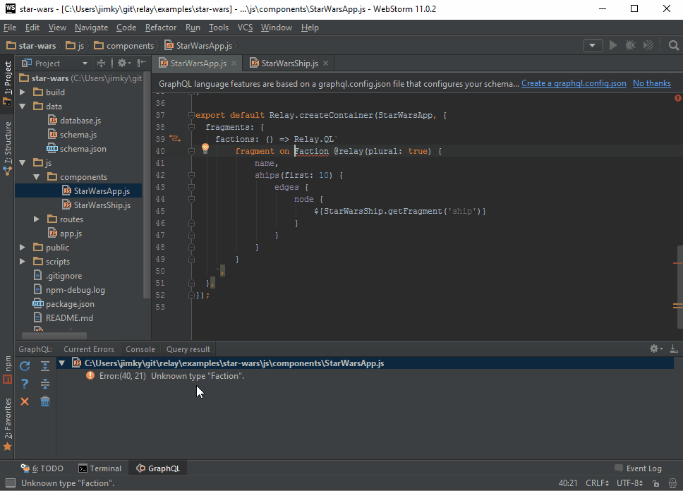

# JS GraphQL IntelliJ Plugin

GraphQL language support including Relay.QL tagged templates in JavaScript and TypeScript.

It provides the following features in IntelliJ IDEA, WebStorm, RubyMine, PhpStorm, and PyCharm:

- Schema-aware completion and error highlighting
- Syntax highlighting, code-formatting, folding, commenter, and brace-matching
- Configurable GraphQL schema retrieval and reloading based on a local file or a url using 'then-request'
- View and browse the schema documentation in-editor using Ctrl/Cmd+Click or the documentation tool window
- Execute queries with variables against configurable endpoints

It depends on [js-graphql-language-service](https://github.com/jimkyndemeyer/js-graphql-language-service) that it manages using a Node.js process handler.

## Features demo

## FAQ

**Which IDEs are compatible with the plugin?**

The plugin is compatible with version 143+ of IntelliJ IDEA, WebStorm, RubyMine, PhpStorm, and PyCharm.

PyCharm CE and Android studio is not supported since the plugin depends on two other plugins: NodeJS and JavaScript.

**Where can I get the plugin?**

The plugin is available from the JetBrains Plugin Repository at https://plugins.jetbrains.com/plugin/8097?pr=

To install it, open "Settings", "Plugins", "Browse repositories..." and search for "JS GraphQL".

**How do I reload a GraphQL Schema that was loaded from a URL?**

In the the GraphQL tool window, select the "Current Errors" tab and click the "Restart JS GraphQL Language Service" button. 

## License
MIT
