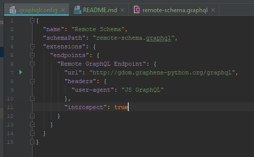
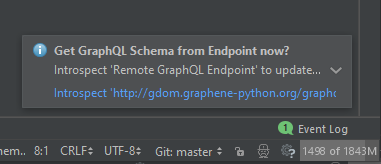
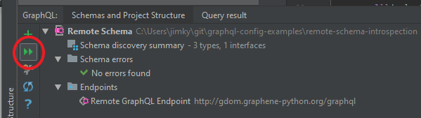
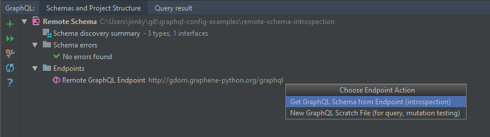

This developer guide covers how to setup your project to get the most out of the GraphQL language tooling in this plugin.

The main features of the plugin are:

- Schema-aware completion, error highlighting, and documentation
- Completion and error highlighting for schema authoring using the GraphQL Type System Definition Language (SDL)
- Syntax highlighting, code-formatting, folding, commenter, and brace-matching
- 'Find Usages' and 'Go to Declaration' for schema types, fields, and arguments
- Execute queries with variables against configurable GraphQL endpoints
- Introspect GraphQL endpoints to generate schema declaration files using the GraphQL Type System Definition Language 
- Support for multi-schema projects using configurable project scopes or graphql-config files 

The most important aspect of using the plugin is to configure how schema types are discovered.
If the schema types are not discovered correctly, language features such as completion and error highlighting
will be based on the wrong type information.

Schemas and their types are declared using [GraphQL Type System Definition Language](https://graphql.github.io/graphql-spec/June2018/#sec-Type-System)
which is also widely known as GraphQL Schema Definition Language (often abbreviated as SDL).

If you're authoring your schemas in SDL, the plugin provides the following features:

- Completion on types when defining fields, arguments, implemented interfaces etc.
- Error highlighting of schema errors such as unknown types, wrong use of types, missing fields when implementing interfaces
- Find usages in SDL and refactoring such as rename which will update the relevant queries, mutations etc.

For use cases where you don't declare the schema in the project, an introspection query can be executed against a
GraphQL endpoint URL to write the schema to a `.graphql` file as SDL. See [Working with GraphQL Endpoints](#working-with-graphql-endpoints-and-scratch-files).

## Project Structure and Schema Discovery
By default, the plugin assumes that your project only contains a single schema. If this is the case, you don't need
to take any action in terms of schema discovery. For a single-schema project, schema types are discovered as follows:

- All .graphql files in the "Project files" scope are processed for type definitions which are added to a singleton type registry
- If the IDE has JavaScript language support, injected GraphQL strings in the "Project files" scope are processed for all
  JavaScript file types. File extensions include `.js`, `.jsx`, `.ts`, and `.tsx`. Injected GraphQL is found based on
  Tagged Template Literals with one of the following tags: `graphql`, `.gql`, and `Relay.QL`.

For projects with multiple schemas, developers have to configure a scope for each schema. The purpose of a schema-specific
scope is to prevent types from being picked up in more than one GraphQL type registry, which would likely result in validation
errors as types appear to have been declared more than once. In addition, the scopes prevent non-conflicting types from
showing up in completions and ensure that validation only recognizes the types that belong to the current schema.

The plugin allows you to configure your schema scopes using [graphql-config v2](https://github.com/kamilkisiela/graphql-config/tree/legacy) configuration files with `includes` and `excludes` glob patterns

### Example projects ###

See https://github.com/jimkyndemeyer/graphql-config-examples for example uses of `.graphqlconfig` to control schema discovery.

### Setting up Multi-schema Projects using graphql-config
Please familiarize yourself with the [graphql-config v2 format](https://github.com/kamilkisiela/graphql-config/tree/legacy/specification.md)
before proceeding.

The next step is to decide where to place the `.graphqlconfig` file. The config file controls schema discovery from the
directory it's placed in, as well as any sub folders that don't have their own `.graphqlconfig`.
 
To create a `.graphqlconfig` file, right click a folder and select "New GraphQL Configuration File" or use the "+" Button in the GraphQL Tool window tab called "Schemas and Project Structure".

Depending on your preference, you can use a single `.graphqlconfig` file in a folder that is a parent to each schema
folder, or you can place `.graphqlconfig` files in each schema folder.

__Option A: Multiple config files (recommended):__

```
- project root/
    - product a (schema one)/
        - .graphqlconfig <-----
        - schema files and graphql aware components
    - product b (schema two)/
        - .graphqlconfig <-----
        - schema files and graphql aware components
```

With this approach the location of the config files creates separate scopes for the two schemas. 

__Option B: Single config file:__

```
- project root/
    - .graphqlconfig <-----
    - product a (schema one)/
        - schema files and graphql aware components
    - product b (schema two)/
        - schema files and graphql aware components
```

With a single config file you need to separate the schemas using the `includes` globs of the `projects` field:

```
{
  "projects": {
    "product a": {
      "includes": ["product a (schema one)/**"]
    },
    "product b": {
      "includes": ["product b (schema two)/**"}
    }
  }
}
```


### Working with GraphQL Endpoints and Scratch Files

You can use GraphQL scratch files to work with your schema outside product code, e.g. by writing temporary queries to
test resolvers. 

To run queries or mutations against your GraphQL endpoint, add your endpoint details to a `.graphqlconfig` file. If you
don't already have a config file, you can create one by right-clicking on your project base dir and choosing 
"New" - "GraphQL Configuration File". If you already have a config file, you can jump to it using the "Edit .graphqlconfig"
toolbar button in the top left side of the scratch file editor.

See https://github.com/kamilkisiela/graphql-config/tree/legacy#specifying-endpoint-info for the expected format of endpoint details such as
the URL, headers etc.

The following example is from [graphql-config-examples/remote-schema-introspection](https://github.com/jimkyndemeyer/graphql-config-examples/tree/master/remote-schema-introspection)

It demonstrates how to use the endpoints configured in `.graphqlconfig` to fetch an existing remote schema.



With `introspect: true` the plugin asks at project startup whether to update the local schema using the configured endpoint.



The update works by sending an introspection query to the endpoint, and then writing the result to the configured `schemaPath`.

The latest introspection query can easily be re-run using the schemas panel:



Introspection queries can also be executed by double-clicking endpoints in the schemas tree view:

 

__Notes and comments__
- If you're both developing the server schema and consuming it in a client, e.g. via component queries, you'll get the best tooling by having your schema expressed using GraphQL Schema Definition Language directly in your project. With that setup the plugin immediately discovers your schema, and you don't have to perform an introspection after server schema changes.
- Tip: The re-run introspection action can be bound to a keyboard shortcut for convienience
