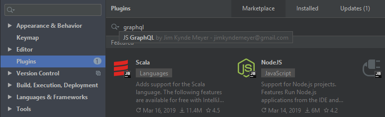

## Prerequisites

The plugin and this documentation site assumes you are already familiar with the GraphQL language. If you're not, please
visit the official [graphql.org](https://graphql.org/) website first.

The plugin works out of the box with popular GraphQL clients such as [Apollo GraphQL](https://www.apollographql.com/) and 
[Relay](https://facebook.github.io/relay/), but you're free to choose your client and server frameworks. 

## Installation

The plugin is hosted in the JetBrains Plugin Repository at https://plugins.jetbrains.com/plugin/8097-js-graphql

You can install it directly from your IDE via the "Settings > Plugins" screen.

On the "Marketplace" tab simply search for "graphql" and select the "JS GraphQL" suggestion:

 

## Compatible IDEs and Versions

The plugin works with all IDEs in the IntelliJ Platform, including but not limited to WebStorm, PhpStorm, IntelliJ IDEA, 
and Android Studio. The minimum version is 2018.2 (182.711 or later).